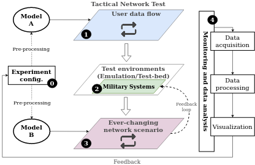
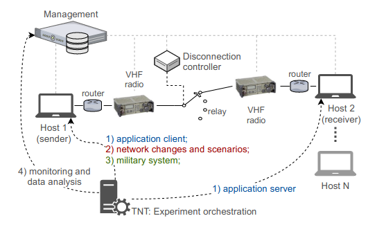
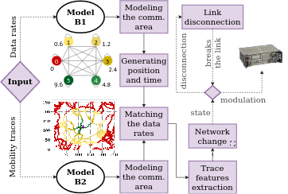
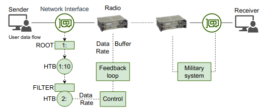
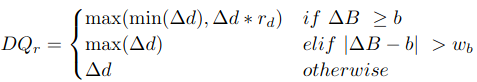
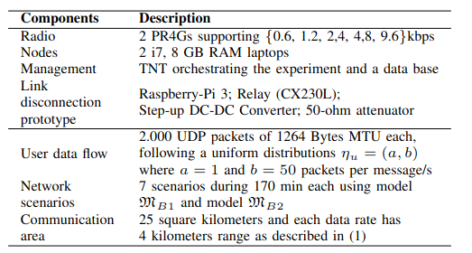

# TNT: A Tactical Network Test platform to evaluate military systems over ever-changing scenarios
//[](https://www.fkie.fraunhofer.de)

TNT platform is designed to automate tests to evaluate military systems and 
applications over a variety of network conditions and user data flows. 
The test results are composed by the system performance evaluation and the 
test scenario characterization.

## TNT Design



### Dependencies
This project has been written in Python and needs Python 3.7 or higher.
Besides the Mininet-Wifi framework the experiment requires the following Python libraries:

 - numpy
 - pandas
 - matplotlib
 - pyshark

Furthermore, the experiment uses `D-ITG` to generate a data flow.
Documentation and installation instructions can be found here:
[http://traffic.comics.unina.it/software/ITG/index.php](http://traffic.comics.unina.it/software/ITG/index.php)

```shell
install d-itg: $ sudo apt install d-itg
```

```shell
git clone https://github.com/KimiNewt/pyshark.git
cd pyshark/src
python setup.py install
```

## Getting Started
TNT was instantiated to perform experiments over real military radios, thus the infrastructure consists of VHF radios,
Linux QDISC, the link disconnection prototype, and a data monitoring and analysis process to measure the data sent and
received, computing the packets and the trace statistics through a single script (orchestrator -
[auto_testbed_experiment](experiment_testbed/auto_testbed_experiment.py)), as illustrated in the figure below. 



```shell
python auto_testbed_experiment.py
```

In this figure, TNT orchestrates the experiment by deploying all necessary scripts over the network nodes right before 
the experiment starts. After the user configures the experiment (radio ip address, disconnection prototype ip address, 
trace files, interval between experiments, duration of the whole experiment, etc...), TNT starts the experiment deploying: 

### (1) 
The application on the sender ([itg_sender](experiment_testbed/itg_sender.py)) and receiver 
([itg_receiver](experiment_testbed/itg_receiver.py)) nodes (representing the user data flow - client and server); 

### (2)
The network changes mechanism and the network scenarios based on mobility traces 
(Model B1 - [model_b1](model_b1/README.md), Model B2 - [model_b2](model_b2/README.md))
in the sender node, which has the interface with the radio and with the link disconnection prototype as shown in the figure below 
([external repository for creating a disconnection device](https://github.com/prettore/link-disconnection-prototype)); 



### (3) 
The military system (here the adaptive data flow - shaping mechanism) is shown in the figures below on
the sender node in order to avoid buffer overflow ([data_shaping](military_system/data_shaping.py));  For more details, 
please read the referred article.

 



### (4) 
The monitoring and data analysis which collect, prepare ([tb_data_acquisition](experiment_testbed/tb_data_acquisition.py)), 
processing ([tb_packet_processing](experiment_testbed/tb_packet_processing.py)) and visualize the experiment outputs 
([main_data_analysis](data_analysis/main_data_analysis.R)) using R.

_**Note:** Additional important information for the usage of this project can be found in the comments of the python scripts.
We strongly recommend looking into the code of those files before using them._

### The experiment setup
The experiments reported in the referred article and the data available ([statistics](experiment_testbed/data) and 
[data_analysis](data_analysis/img)) follows the setup described below: 

The tactical network is composed of two VHF radios (PR4G), with 128kb of buffer size and supporting five data
rates {0.6, 1.2, 2.4, 4.8, 9.6} kbps, each connected to a node (sender and receiver, respectively). The radio antennas are
wired and connected to a link disconnection prototype in order to simulate the state {0}, disconnection. Then, the network
condition is changed using mobility traces as described in  Model B1 - [model_b1](model_b1/README.md) and 
Model B2 - [model_b2](model_b2/README.md). The experimental setup with all components used by TNT is described in the Table below.



How to cite
----
If you decided to use this project or part of it, please, refer to it as:

-  Rettore, Paulo H.; Loevenich, Johannes; Rigolin F. Lopes, Roberto; Sevenich, Peter (2021): "TNT: A Tactical Network Test platform to evaluate military systems over ever-changing scenarios", in IEEE/ACM Transactions on Networking, TechRxiv. Preprint. https://doi.org/10.36227/techrxiv.14141501.v1 

Publications
----

- P. H. Balaraju, P. H. L. Rettore, R. R. F. Lopes, S. M. Eswarappa and J. Loevenich, "Dynamic Adaptation of the User Data Flow to the Changing Data Rates in VHF Networks: An Exploratory Study," 2020 11th International Conference on Network of the Future (NoF), Bordeaux, France, 2020, pp. 64-72, doi: 10.1109/NoF50125.2020.9249226.

- R. R. F. Lopes, J. Loevenich, P. H. L. Rettore, S. M. Eswarappa and P. Sevenich, "Quantizing Radio Link Data Rates to Create Ever-Changing Network Conditions in Tactical Networks," in IEEE Access, vol. 8, pp. 188015-188035, 2020, doi: 10.1109/ACCESS.2020.3027797.

- R. Rigolin Ferreira Lopes, P. Hanavadi Balaraju, P. H. Lopes Rettore and P. Sevenich, "Queuing over Ever-changing Communication Scenarios in Tactical Networks," in IEEE Transactions on Mobile Computing, doi: 10.1109/TMC.2020.3005737.

Contacts
----

paulo.lopes.rettore@fkie.fraunhofer.de

johannes.loevenich@fkie.fraunhofer.de

roberto.lopes@fkie.fraunhofer.de

License
----

GPL
