# Transforming sequences of data rates into mobility patterns: 
Model Mode B1 creates mobility patterns
from a given sequence of data rates (Σ), resulting in an enriched trace ΓE = {(st0 , p0, σ0), . . . , (stN −1 , pN −1, σN −1)},
that describes a given mobility pattern. TNT executes the
following steps to transform a sequence of data rates into
a mobility trace. First, we define a mapping of the system
state S to a set A0, . . . , AN −1 of circular areas inspired by
the wave propagation of omni-directional antennas. After that,
we use inverse transform sampling to create the positions
p0, . . . , pN −1 and the resulting enriched mobility trace ΓE .
Besides that, the mobility statistics from ΓE are extracted and
the resulted trace is used to change the radio link data rate or
create link disconnections. For more details, 
please read the referred article.


## Getting Started
Execute the script [datarate_to_trace](datarate_to_trace.py) to create mobility traces from stochastic models. 

```shell
python datarate_to_trace.py
```

A brief description of the model is shown below. For more details regarding the configuration and creation of the 
stochastic model see the repository [ever-changing](https://github.com/deepboltzer/ever-changing). 

_**Note:** Additional important information for the usage of this project can be found in the comments of the python scripts.
We strongly recommend looking into the code of those files before using them._


# :arrows_counterclockwise: Ever-changing commmunication scenarios for tactical networks :arrows_counterclockwise:
This is an initial approach to create ever-changing communication scenarios for tactical networks. 
In this case the term "ever-chaning" is related to the data rate of our VHF radios, which support 5 possible 
data rates. All the experiments created with this framework consist of communication scenarios defined by ever-changing 
data rates between 0.0 kbps (disconnected) ,0.6 kbps,1.2 kbps,2.4 kbps,4.8 kbps and 9.6 kbps. 

:space_invader: :space_invader: :space_invader: :space_invader:

## :wrench: Requirements :wrench:

`python 3.6 or higher`
`numpy`
`pandas`
`quantecon`
`networkx`
`matplotlib`
`POT`
`psycopg2`
`logbook`
`sqlalchemy` 

For installation you can use `pip install -r requirements.txt`. 

## :memo: Usage :memo:

1. Change the `config.py` by adding a new configuration for your experiment. The parameters are as follows: 
    - `transition_matrix_names:` Comma seperated string holding the names for the transition matrix of the 
    respective markov chains.
    - `transition_matrix_file_path:`File path to the `.csv` matrix file 
    - `pendulum_pattern:` Definition of the pendulum pattern through all possible data rates, if needed in 
    the scenario.
    - `scenario:` Comma seperated string defining the order of the transition matrices in the communication 
    scenario
    - `state_values:` Comma seperated string of possible data rates of the radios. 
    - `initial_datarate:` Initial data rate for the experiment, that is used as initial state for the first 
    Markov chain. 
    - `number_steps:` The number of steps that the experiments follow the respective transition matrix in 
    `scenario`.
    - `multiple:` a string representation of an integer, which defines the rows and columns of the output plot.
                  Not recommended to be greater than 10. Otherwise also set the size of the plt figures, s.t.
                  they can handle `multiple`.
    Then run `config.py` as main function to update the `config.ini` file regarding to your experiment
    configuration.

2. Create a new experiment using the Experiment.py class. An example can be seen in main.py. 
    - Use `experiment = exp.Experiment('CONFIG_NAME')` to create a new experiment, where `CONFIG_NAME` is the name of the
    configuration that you want to use from `config/config.ini`.
    - `experiment.dict` gives you the dictionary representation of the experiment. You can print it with
    `print(experiment.dict)`
    - Use `experiment.plot_transition_matrices()` to plot the Markov chains represented by the `transition_matrices` 
    from the `CONFIG_NAME.ini`. 
    
    An example output can look like this: 
    
    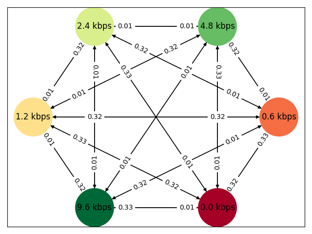
    
   - You can save your experiment to a pickle file using `Experiment.save_model(FILE_NAME)`, where `FILE_NAME`is the name 
   of the destination `.p` pickle file (without `.p`)
   
 3. Once you created an experiment you can use the experiment to create a new instance of
 a communication scenario and run the experiment:
    - Use `comm_scenario = CommunicationScenario.CommunicationScenario(EXPERIMENT)`,where `EXPERIMENT`is an
    instance of the `Experiment.py` class. 
    - Then you can use `comm_scenario.init_communication_scenario()` to run the experiment. The sequence of
    ever-changing data rates can be get directly from the return value of the method or from 
    `comm_scenario.sequence`.
    - To plot the scenario use `comm_scenario.plot_communication_scenario('test_scenario')`. 
    This creates a set of `.png` files in the `img/` directory. Each file holds a plot of 
    100 states in 2 rows each of dimension 10x10. 
    
    An example output can look like this: 
    
    Ever-changing datarates         |    Ever-changing datarates 
    :-------------------------:|:-------------------------:
    States 1-100             |  States 100-200 
    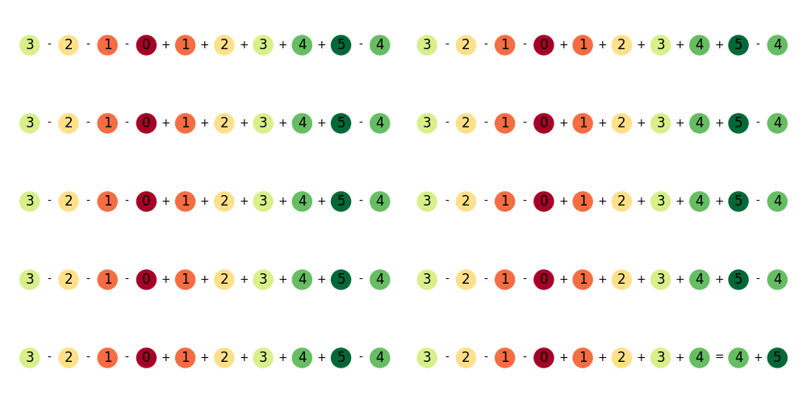  |  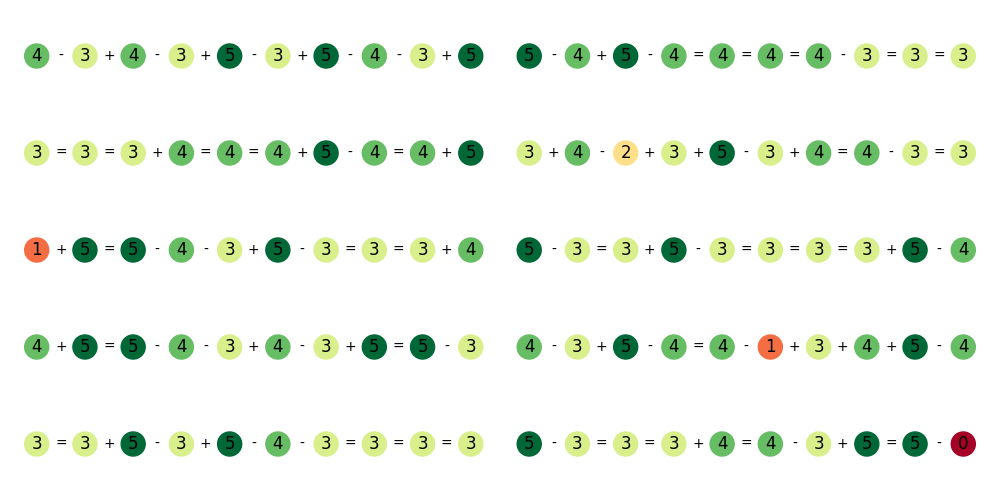
    States 200-300             |  States 300-400 
    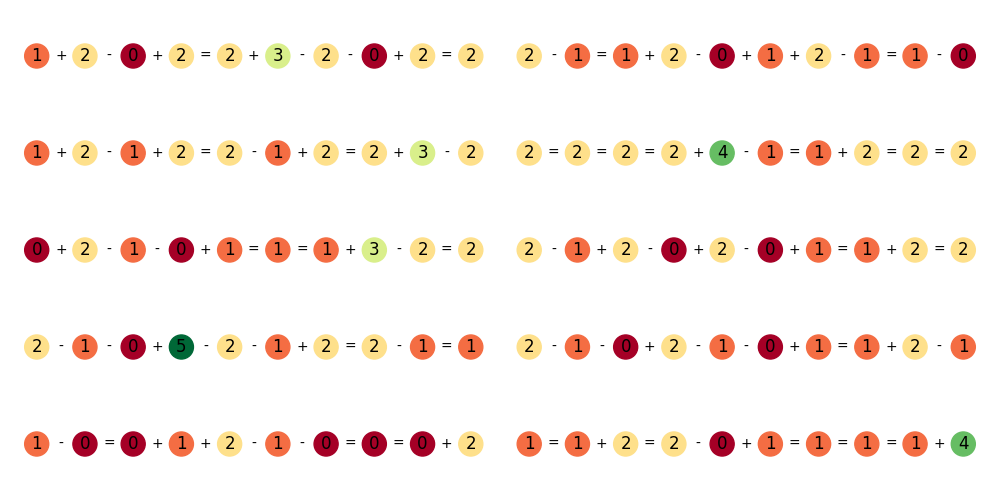  |  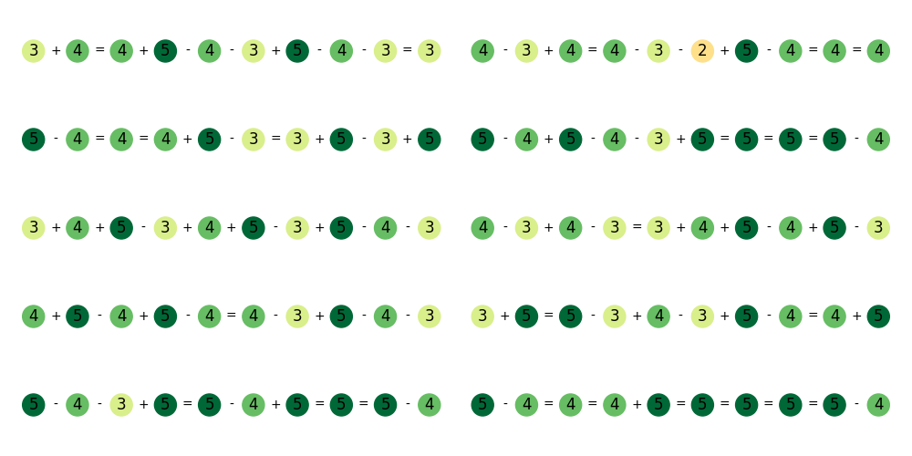
    States 400-500             |  States 500-600 
      |  
    
    - You can also update a communication scenario using `CommunicationScenario.update_communication_scenario(EXPERIMENT)`,
    where `EXPERIMENT` is an instance of the `Experiments.py` class. It should be noted that you can always access
    previous experiments by accessing the list of experiments `CommunicationScenario.experiments` of the `CommunicationScenario`
    instance. You can also set the `CommunicationScenario` parameters to the respective experiment by using 
    `CommunicationScenario.update_paramerters(EXPERIMENT)`. But this is always important if you are running back in time. 
    If you update forward in time parameters are set automatically to the actual `EXPERIMENT` instance.
    
 4. If you want to use the ever-changing communication scenario from the laboratory you can use the `RaspiConnector()` 
    class to create a new connection to the Raspberry Pi in the laboratory. Once you initiated the connection you can use 
    the `disrupt_radio()` method to handle disruptions from the scenario. 
    
 5. There is the possibility to measure the similarity of different patterns using wasserstein distance for two distributions 
 and wasserstein barycenters for experiments with mixture models arising from multiple markov chains. 
 Here is an example output for two gaussian distributions: 
 
 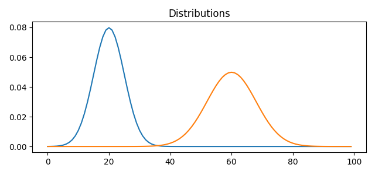 
 
 
 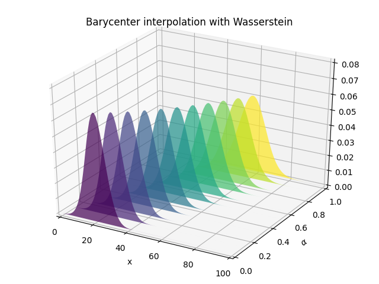 
 
 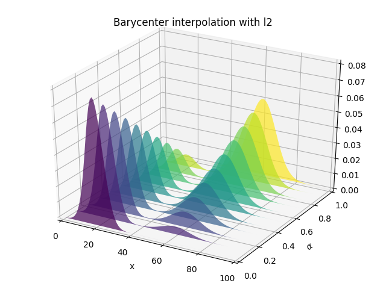 
 
 Given the state at time t of our markov chain we can shape the distribution for state at time t+1
 in our markov chain using wasserstein or L2 barycentric interpolation. The result for the 1d probability distributions
 `[1,0,0,0,0,0]` (system state at time t+1 is disconnected) and `[0,0,0,0,0,1]` (system state at time t+1 is fully connected) 
 are shown below:
 
  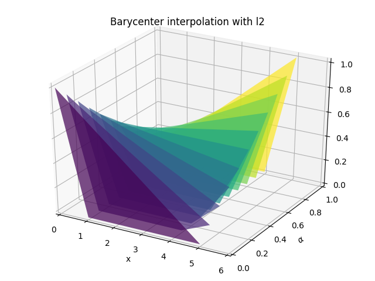 
 
 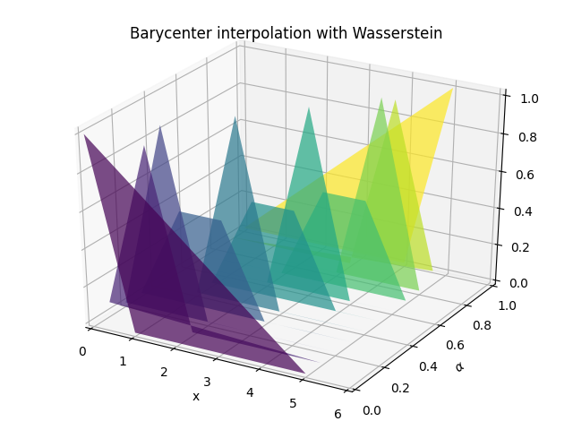 

6. The wasserstein barycentric interpolation can also be used to transform on pattern matrix B1 into another pattern 
matrix B2. All methods that are needed to transform 2 patterns are available in the `PatternTransitions.py` module. 
This module is based on the `OptimalTransport.py` module. This module enables us to create new experiments and communication
scenarios resulting from the interpolated 2D transformation matrices while transforming one pattern into another. 
An example for the two patterns:

```python 
    B1 = [[1.0, 0.0, 0.0, 0.0, 0.0, 0.0],
           [1.0, 0.0, 0.0, 0.0, 0.0, 0.0],
           [1.0, 0.0, 0.0, 0.0, 0.0, 0.0],
           [1.0, 0.0, 0.0, 0.0, 0.0, 0.0],
           [1.0, 0.0, 0.0, 0.0, 0.0, 0.0],
           [1.0, 0.0, 0.0, 0.0, 0.0, 0.0]] 

    B2 = [[0.0, 0.0, 0.0, 0.0, 0.0, 1.0],
           [0.0, 0.0, 0.0, 0.0, 0.0, 1.0],
           [0.0, 0.0, 0.0, 0.0, 0.0, 1.0],
           [0.0, 0.0, 0.0, 0.0, 0.0, 1.0],
           [0.0, 0.0, 0.0, 0.0, 0.0, 1.0],
           [0.0, 0.0, 0.0, 0.0, 0.0, 1.0]] 
```

A scenario, where the start and end patterns are a little bit less concrete results in scenario with 
a little higher variance. This can be done using B1 and B2 defined as:
```python 
    B1 = [[0.67,0.33, 0.0, 0.0, 0.0, 0.0],
           [0.67,0.33, 0.0, 0.0, 0.0, 0.0],
           [0.67,0.33, 0.0, 0.0, 0.0, 0.0],
           [0.67,0.33, 0.0, 0.0, 0.0, 0.0],
           [0.67,0.33, 0.0, 0.0, 0.0, 0.0],
           [0.67,0.33, 0.0, 0.0, 0.0, 0.0]]

    B2 = [[0.0, 0.0, 0.0, 0.0, 0.1, 0.9],
           [0.0, 0.0, 0.0, 0.0, 0.1, 0.9],
           [0.0, 0.0, 0.0, 0.0, 0.1, 0.9],
           [0.0, 0.0, 0.0, 0.0, 0.1, 0.9],
           [0.0, 0.0, 0.0, 0.0, 0.1, 0.9],
           [0.0, 0.0, 0.0, 0.0, 0.1, 0.9]]
```
The correspnding 1D interpolation of `[0.67,0.33, 0.0, 0.0, 0.0, 0.0]` into 
`[0.0, 0.0, 0.0, 0.0, 0.1, 0.9]` can be visualized as follows: 


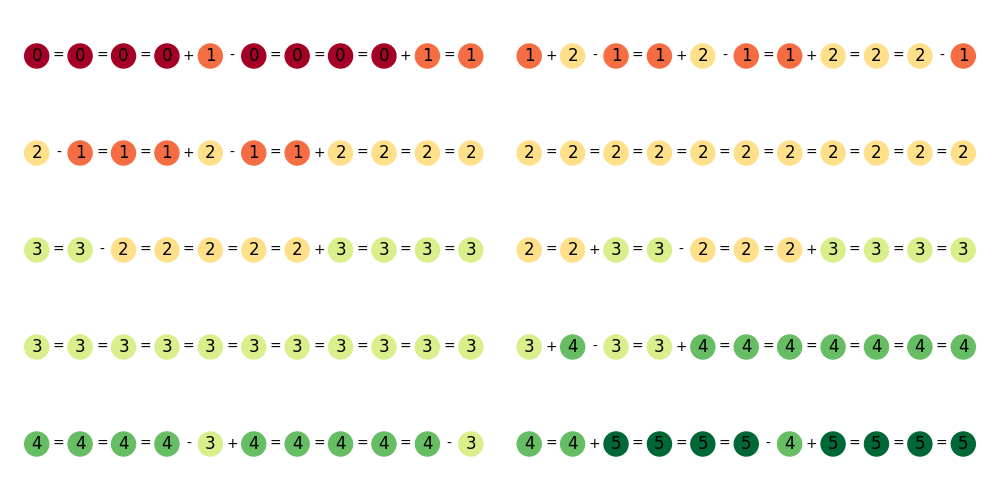 


